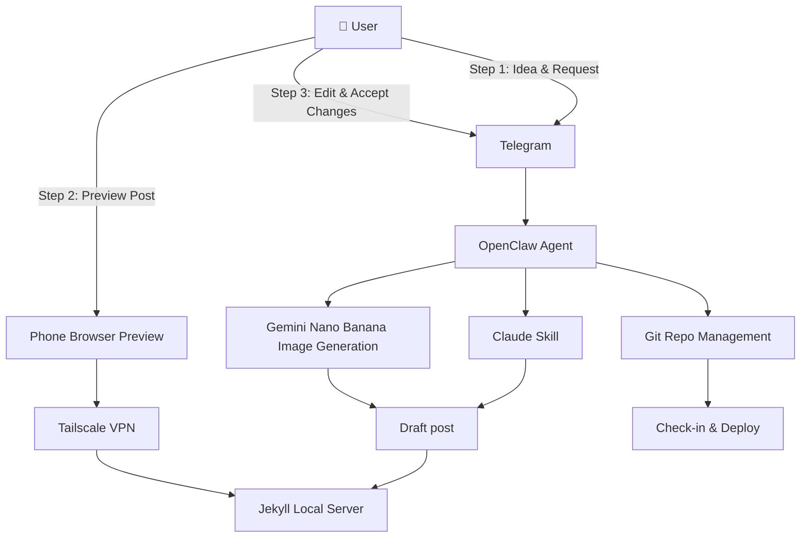

Creating a tech blog shouldn't be a chore. In this post, I'll show you how I've streamlined my workflow using **OpenClaw** and **Tailscale** to manage my **Jekyll** tech blog from my phone.

## The Workflow

The core idea is simple: use OpenClaw as the central orchestrator for the entire blog lifecycle. The workflow consists of three main steps:

### Step 1: Content Creation & Image Generation

When I have an idea for a blog post, I send a message through **Telegram** to my OpenClaw agent. This triggers a sophisticated automation chain:

1. **OpenClaw receives the request** and begins orchestrating the workflow
2. **Git Repository Management**: OpenClaw ensures the local Jekyll repository is up-to-date by pulling the latest changes
3. **Claude Skill Activation**: OpenClaw invokes a custom Claude skill designed specifically for Jekyll blog post creation
4. **Draft Generation**: The Claude skill generates a comprehensive draft post with:
   - Proper Jekyll front matter (title, date, categories, tags)
   - Structured markdown content based on my idea
   - Placeholder for hero image
5. **Image Generation**: In parallel, OpenClaw sends a prompt to **Gemini Nano Banana** to generate an appropriate hero image for the post
6. **Image Integration**: The generated image is downloaded and referenced in the post's front matter
7. **Local Preview**: OpenClaw starts the **Jekyll local server** so the post can be previewed

### Step 2: Remote Preview via Tailscale

Rather than being tied to my desktop, I can preview the post from anywhere using my phone:

1. **Tailscale VPN** creates a secure tunnel to my home network where the Jekyll server is running
2. I access the local Jekyll server URL (e.g., `http://homeserver:4000`) through my **phone browser**
3. The draft post renders exactly as it would appear on the live blog
4. I can scroll, read, and evaluate the content and image quality on a real mobile device

### Step 3: Iteration & Deployment

After reviewing the preview, I can:

1. Send **edit requests** back through Telegram to OpenClaw
2. OpenClaw applies the changes and regenerates the preview
3. Once satisfied, I **accept the changes** via Telegram
4. OpenClaw handles the **Git check-in and deployment**:
   - Commits the new post and image files
   - Pushes to the remote repository
   - Triggers the GitHub Pages build

### Why This Workflow Works

This setup delivers several key advantages:

- **Mobile-First**: I can manage my entire blog from my phone, whether commuting, traveling, or away from my desk
- **Automated Image Generation**: No need to search for stock photos or create graphics manually
- **Real Device Preview**: See exactly how posts will look on mobile before publishing
- **Secure Remote Access**: Tailscale provides zero-trust network access without exposing services to the internet
- **Git-Native**: All changes are properly versioned and deployed through standard Git workflows
- **AI-Assisted Writing**: Claude handles the heavy lifting of post structure and content generation

## References

Here are the tools and services that make this workflow possible:

- **[OpenClaw](https://github.com/OpenClaw/openclaw)** - AI agent orchestration platform for Telegram-based automation
- **[Tailscale](https://tailscale.com/)** - Zero-config VPN built on WireGuard for secure remote access
- **[Gemini Nano Banana](https://gemini.google/overview/image-generation/)** - AI-powered image generation service
- **[Jekyll](https://jekyllrb.com/)** - Static site generator for blogs and documentation
