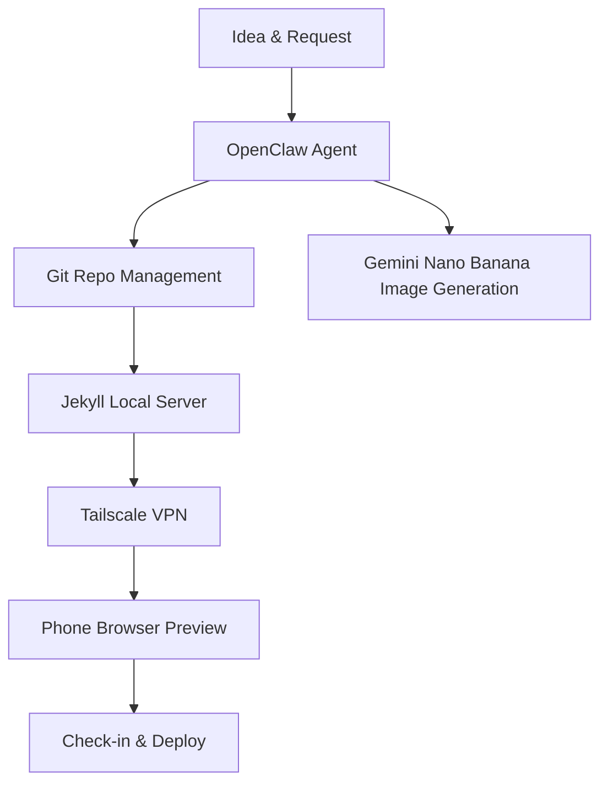

Creating a tech blog shouldn't be a chore. In this post, I'll show you how I've streamlined my workflow using **OpenClaw**, **Jekyll**, and **Tailscale** to manage everything from my phone.

## The Workflow

The core idea is simple: use OpenClaw as the central orchestrator for the entire blog lifecycle.

### 1. Repository Management with OpenClaw

Instead of manually creating files and managing front matter, I use a custom OpenClaw skill (`new-post`). I just describe the topic, and the agent:
- Generates SEO-friendly metadata.
- Handles slugs and date formatting.
- Creates the standardized directory structure for assets.

### 2. AI-Powered Visuals

A good tech blog needs visuals. By leveraging the `nano-banana-pro` skill, I can generate custom hero images and diagrams directly within the chat. These are automatically placed into the correct asset folder for the post.

### 3. Remote Preview via Tailscale

Since my development server is running on a VM, I use **Tailscale** to bridge the gap. Tailscale creates a secure private network, allowing me to access `http://vm-airbot:4000` from my phone's browser as if I were sitting at my desk.

### 4. Instagram Management

The most convenient part? The entire interaction happens over a messaging app like Instagram or Telegram. I can kick off a build, review a draft, and approve a pull request while on the go.

## Conclusion

By combining these tools, I've turned a complex static site workflow into a conversational one. I can focus on writing while OpenClaw handles the heavy lifting.

*Ready to try it? Ask OpenClaw to start a new post for you today!*
