## Introduction

Have you ever wanted to write a blog post while commuting, waiting at a coffee shop, or lounging on your couch with just your phone or tablet? Traditional Jekyll blogging workflows require a full development environment: Ruby, Bundler, Git, and a proper IDE. But what if you could blog from anywhere, using just a mobile browser?

That's exactly what Claude Code Cloud Environment enables. In this post, I'll show you how I'm writing this very article using nothing but Claude Code on the web, accessed from any device—even an Android phone—while the cloud environment handles all the heavy lifting.

## The Problem with Traditional Jekyll Blogging

Static site generators like Jekyll are powerful, but they come with significant friction:

- **Development Environment**: You need Ruby, Bundler, and various dependencies installed locally
- **Git Operations**: Manual commits, branch management, and push operations
- **Mobile Limitations**: Try running `bundle exec jekyll serve` on your phone—it's just not happening
- **Consistency**: Different machines, different Ruby versions, different problems

For someone who wants to capture ideas on the go, this setup is a dealbreaker.

## Enter Claude Code Cloud Environment

Claude Code Cloud (claude.ai/code) solves this elegantly by providing:

1. **Zero Setup**: No local development environment needed
2. **Git Integration**: Automatic repository cloning and branch management
3. **Custom Skills**: Reusable AI-powered workflows for common tasks
4. **Mobile Accessibility**: Works from any device with a web browser
5. **Pull Request Workflow**: Creates PRs for review before publishing

## How This Workflow Actually Works

Let me walk you through the exact workflow I used to create this post—the same one you can use from your phone or tablet.

### Step 1: Access Claude Code from Anywhere

I opened Claude Code Cloud on my device (in my case, accessible from mobile browser):

```
https://claude.ai/code
```

That's it. No IDE to install, no dependencies to manage. Just a browser.

### Step 2: Let Claude Code Handle the Repository

I simply told Claude Code:

> "Download the source code and use the new-post skill to create a new blog post about using Claude Code Cloud Environment for Jekyll blogging"

Behind the scenes, Claude Code:
- Automatically cloned my git repository
- Checked out the designated feature branch
- Set up the development environment
- Identified available custom skills

### Step 3: Custom Skills Do the Heavy Lifting

My repository includes a custom skill at `.claude/skills/new-post/` that:

```bash
# Activates Python environment
source .venv/bin/activate

# Runs the post generator with intelligent metadata
python3 tools/new-post.py \
  --title "Your Title" \
  --description "Your description" \
  --categories "Tech, AI" \
  --tags "your, tags, here" \
  --mermaid \
  --image-path "banner.png"
```

The skill intelligently:
- Generates multiple title suggestions based on existing post patterns
- Creates SEO-friendly descriptions
- Recommends appropriate categories and tags
- Sets up image directories
- Creates the post file with proper front matter

### Step 4: AI-Assisted Content Creation

Once the post structure is created, I collaborate with Claude Code to write the actual content. I provide the ideas, Claude Code helps structure and articulate them—just like we're doing right now.

### Step 5: Automated Git Workflow

When the post is ready, Claude Code:

```bash
# Stages the changes
git add _posts/2026-02-10-your-post.md

# Creates a descriptive commit
git commit -m "Add new blog post: Your Title

Detailed commit message...

https://claude.ai/code/session_xxx"

# Pushes to the feature branch
git push -u origin claude/your-feature-branch
```

All of this happens automatically—no terminal commands needed.

### Step 6: Pull Request for Review

Finally, I can ask Claude Code to create a pull request:

```bash
gh pr create --title "Your PR Title" --body "Summary of changes..."
```

This gives me a chance to:
- Review the changes on GitHub
- Preview the post in the PR
- Make any final edits
- Merge when ready

## The Mermaid Workflow Diagram

Here's a visual representation of this entire workflow:

```mermaid
graph TD
    A[📱 Mobile Device/Browser] -->|Access| B[Claude Code Cloud]
    B -->|Clone Repository| C[GitHub Repository]
    C -->|Download| D[Cloud Environment]
    D -->|Execute| E[Custom Skills]
    E -->|Generate| F[Blog Post Structure]
    F -->|AI Collaboration| G[Content Creation]
    G -->|Git Commit| H[Feature Branch]
    H -->|Push| I[GitHub Remote]
    I -->|Create| J[Pull Request]
    J -->|Review & Merge| K[Published Blog]

    style A fill:#4CAF50
    style B fill:#2196F3
    style E fill:#FF9800
    style G fill:#9C27B0
    style J fill:#F44336
```



## Why This Changes Everything

### 1. **Blog from Anywhere**
   - Coffee shop? ✅
   - Airport lounge? ✅
   - Couch with tablet? ✅
   - Android phone? ✅

### 2. **No Environment Management**
   - No Ruby version conflicts
   - No dependency issues
   - No "works on my machine" problems
   - Cloud environment is always consistent

### 3. **Git Operations Made Simple**
   - No memorizing git commands
   - Proper commit messages automatically
   - Branch management handled for you
   - Pull requests with one request

### 4. **Reusable Workflows**
   - Custom skills encapsulate complex operations
   - Consistent metadata across posts
   - Automated image directory setup
   - Pattern-based suggestions

### 5. **AI-Powered Content**
   - Intelligent title generation
   - SEO-friendly descriptions
   - Tag and category recommendations
   - Content structure assistance

## Setting Up Your Own Workflow

Want to replicate this for your Jekyll blog? Here's what you need:

### 1. Create Custom Skills

Add a `.claude/skills/new-post/` directory to your repository with:
- `SKILL.md`: Instructions for the skill
- `tools/new-post.py`: Python script to generate posts
- `tools/requirements.txt`: Dependencies (jinja2, pytz, python-dateutil)

### 2. Configure Your Repository

Add `CLAUDE.md` to your repository root:

```markdown
# CLAUDE.md

## Overview
This is a Jekyll blog using claude-code-cloud for content management.

## Development
Use the new-post skill to create posts:
- Categories: Tech, AI or Tech, Development
- Tags: lowercase, comma-separated
- Featured images in assets/img/
```

### 3. Enable Branch Management

Configure Claude Code to work with feature branches:
- Branch naming: `claude/your-feature-name-XXXX`
- Automatic branch creation
- Push to remote for PR creation

### 4. Test the Workflow

Try it out:
```
"Use the new-post skill to create a test blog post about [your topic]"
```

## Real-World Benefits

Since adopting this workflow:

- **Capture Ideas Immediately**: When inspiration strikes, I don't need to wait until I'm at my desk
- **Consistent Quality**: AI-powered suggestions ensure proper formatting and SEO
- **Version Control**: Every post goes through proper git workflow
- **Review Process**: Pull requests give me a safety net before publishing
- **Device Flexibility**: I've written posts from my phone, tablet, and laptop seamlessly

## The Technical Setup

For those curious about the infrastructure:

**Jekyll Configuration**:
- Theme: jekyll-theme-chirpy
- Deployment: GitHub Pages
- Environment: Docker-based for local preview

**Claude Code Integration**:
- Custom skills in `.claude/skills/`
- Repository instructions in `CLAUDE.md`
- Python tools in `tools/` directory

**Git Workflow**:
- Feature branches for each post
- Pull request review process
- Automated commit messages with session URLs

## Limitations and Considerations

To be transparent, there are some limitations:

1. **Image Generation**: While I mentioned AI-generated banner images, that skill isn't implemented yet (something for a future post!)
2. **Docker Preview**: Can't run Docker in the cloud environment, so final preview requires local pull
3. **Network Dependency**: Requires internet connection (obviously)
4. **Cost**: Claude Code Cloud is a paid service

## Future Enhancements

Ideas for expanding this workflow:

- **Image Generation Skill**: Integrate with AI image APIs to auto-generate banner images
- **Draft Preview**: Add a preview service accessible from mobile
- **Auto-Publish**: Automatically merge and deploy after review
- **Content Templates**: Pre-built templates for different post types
- **SEO Analysis**: Automated SEO scoring and suggestions

## Conclusion

This isn't just about blogging from your phone—it's about removing friction from the creative process. When the technical setup becomes invisible, you can focus on what matters: your ideas and content.

Claude Code Cloud Environment transforms Jekyll blogging from a desktop-bound technical task into a flexible, mobile-friendly creative workflow. The combination of custom skills, AI assistance, and automated git operations means you can capture and publish ideas from anywhere, anytime.

The blog post you're reading right now is proof of concept. I wrote it using this exact workflow, demonstrating that professional technical blogging doesn't require a traditional development setup anymore.

Ready to try it yourself? Head over to [claude.ai/code](https://claude.ai/code), point it at your Jekyll repository, and start blogging from anywhere.

## Resources

- **Claude Code**: [claude.ai/code](https://claude.ai/code)
- **Jekyll**: [jekyllrb.com](https://jekyllrb.com)
- **Chirpy Theme**: [github.com/cotes2020/jekyll-theme-chirpy](https://github.com/cotes2020/jekyll-theme-chirpy)
- **This Blog's Repository**: Check out `.claude/skills/new-post/` for the complete skill implementation

---

*Have questions about this workflow? Found a clever enhancement? Let me know in the comments below!*