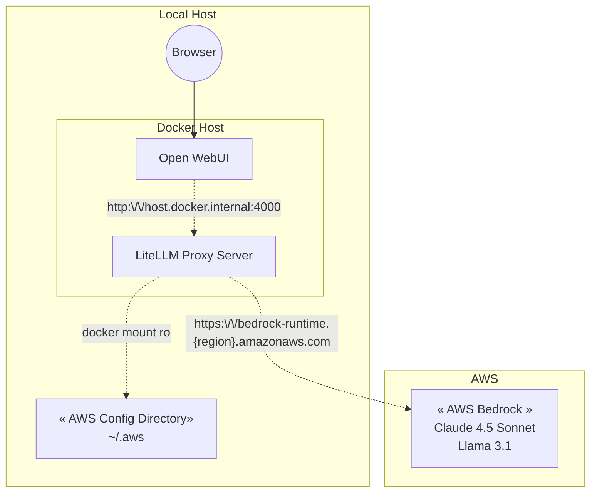

## Purpose

Open WebUI serves as a powerful tool for testing and comparing various open-source models, including those from OpenAI. Its versatility in handling different models makes it a valuable asset for researchers and developers. However, one notable limitation is the absence of built-in support for AWS Bedrock.

In this article, I provide a comprehensive, step-by-step guide on how to connect to AWS Bedrock, enabling you to fully utilize Claude, Llama, and other foundation models within Open WebUI. By following this guide, you'll be able to expand the capabilities of Open WebUI and take full advantage of AWS Bedrock's robust model offerings.

## Configuration Overview

We will be using [*litellm proxy server*](https://www.litellm.ai/) to emulate the OpenAI API and connect to AWS Bedrock. This will allow us to use Bedrock foundation models on Open WebUI.



## Configuration Guide

### Prerequisites

Open WebUI should be installed and configured to run in Docker. If not, follow the setup guide here: [Open WebUI Getting Started](https://docs.openwebui.com/getting-started/).

You'll also need:
- AWS account with Bedrock access enabled in your region
- AWS credentials (Access Key ID and Secret Access Key) with Bedrock permissions
- Model access granted in the AWS Bedrock console

### Configure LiteLLM Proxy Server

1. Create an empty folder with a name of your choice. For this example, we'll call it *my-litellm-proxy*.
2. Navigate into the folder and create a new file named `litellm_config.yaml` with the following content:

   ```yaml
   model_list:
     - model_name: bedrock-claude-4.6-opus
       litellm_params:
            model: bedrock/anthropic.claude-opus-4-6-v1
            model_id: "arn:aws:bedrock:us-east-2:xxxxxxxxxxxx:application-inference-profile/xxxxxxxxxxxx"
            aws_profile_name: "your-aws-profile"
     - model_name: bedrock-claude-4.5-sonnet
       litellm_params:
            model: bedrock/anthropic.claude-sonnet-4-5-20250929-v1:0
            model_id: "arn:aws:bedrock:us-east-2:xxxxxxxxxxxx:application-inference-profile/xxxxxxxxxxxx"
            aws_profile_name: "your-aws-profile"
     - model_name: bedrock-claude-4.5-haiku
       litellm_params:
            model: bedrock/anthropic.claude-haiku-4-5-20251001-v1:0
            model_id: "arn:aws:bedrock:us-east-2:xxxxxxxxxxxx:application-inference-profile/xxxxxxxxxxxx"
            aws_profile_name: "your-aws-profile"
     - model_name: llama-3-1-70b
       litellm_params:
            model: bedrock/meta.llama3-1-70b-instruct-v1:0
            model_id: "arn:aws:bedrock:us-east-2:xxxxxxxxxxxx:application-inference-profile/xxxxxxxxxxxx"
            aws_profile_name: "your-aws-profile"
   ```
3. Use the following command to spin up the LiteLLM proxy server using `docker run`:
    ```bash
    docker run -d \
        -v $(pwd)/litellm_config.yaml:/app/config.yaml \
        -v ~/.aws:/root/.aws:ro \
        -p 4000:4000 \
        --name litellm-proxy \
        --restart always \
        ghcr.io/berriai/litellm:main-latest \
        --config /app/config.yaml --detailed_debug
    ```
    For enhanced observability of your LLM usage, consider using `docker-compose` to spin up the LiteLLM proxy server with a database and Prometheus for monitoring. Follow this guide on how to do it: [LiteLLM Proxy Deployment](https://docs.litellm.ai/docs/proxy/deploy).
4. Now that your LiteLLM proxy is running, test it with the following `curl` command:
   ```bash
   curl --location 'http://0.0.0.0:4000/chat/completions' \
        --header 'Content-Type: application/json' \
        --data '{
        "model": "claude-3-5-sonnet",
        "messages": [
            {
            "role": "user",
            "content": "What is the purpose of life?"
            }
        ]
    }'
   ```

### Configure Open WebUI
1. On Open WebUI, click on the top-right profile icon and go to the Admin Panel.
    <br/>
2. Under the **Admin Panel**, select **Settings**, and click on **Connections** from the left navigation menu.
3. Update the OpenAI API Endpoint as follows:
   - **Endpoint**: `http://host.docker.internal:4000`
   - **Secret**: `AnyDummyValue`
   

## All Set!

You can now access AWS Bedrock models including Claude 4.5 Sonnet, Llama 3.1, and other foundation models directly from Open WebUI!
