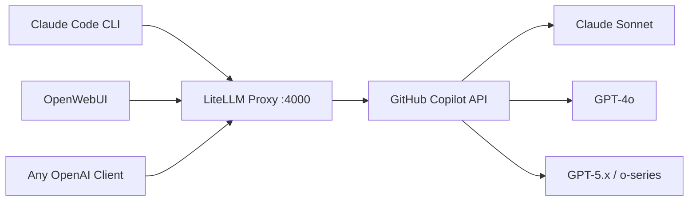

## The Situation

If you have a GitHub Copilot subscription, you already have access to a range of powerful models — including Claude Sonnet 4.6, Claude Opus 4.6, GPT-4.1, GPT-5.x, and more. A [previous post]() covered how to use the `copilot-api` reverse proxy to point Claude Code CLI at your Copilot subscription.

This post takes a more streamlined approach using **LiteLLM Proxy** — an open-source, production-grade LLM gateway that natively supports GitHub Copilot as a provider. The advantage: a single proxy endpoint that works with Claude Code CLI, OpenWebUI, and any other OpenAI-compatible client simultaneously.



## Why LiteLLM Proxy?

[LiteLLM](https://github.com/BerriAI/litellm) is a unified LLM gateway that supports 100+ providers behind a single OpenAI-compatible API. Unlike `copilot-api`, it is:

- **Officially supported by LiteLLM**: `github_copilot/` is a first-class provider in the LiteLLM library — though not officially supported by GitHub itself
- **Multi-client ready**: serves OpenWebUI, Claude Code, and any API client at once
- **Configurable via YAML**: model aliases, rate limits, fallbacks, logging
- **OpenAI-compatible**: drop-in replacement for any tool that speaks the OpenAI API
- **Anthropic-compatible**: also exposes an Anthropic-style API endpoint (`/v1/messages`), so Claude Code and the Anthropic Agent SDK can connect directly without any translation layer

> ⚠️ Note that GitHub Copilot does not officially publish a public API for this use case. Like similar community integrations, LiteLLM authenticates via GitHub's internal token flow. Use it responsibly and in line with GitHub's [acceptable use policies](https://docs.github.com/en/site-policy/acceptable-use-policies/github-acceptable-use-policies).

## Step 1: Set Up LiteLLM

Create an empty folder and add a `config.yaml` file with the following content:

```yaml
model_list:
  - model_name: claude-sonnet-4-6
    litellm_params:
      model: github_copilot/claude-sonnet-4.6

  - model_name: claude-opus-4-6
    litellm_params:
      model: github_copilot/claude-opus-4.6

  - model_name: claude-haiku-4-5
    litellm_params:
      model: github_copilot/claude-haiku-4.5

litellm_settings:
  drop_params: true

general_settings:
  master_key: "sk-litellm-local"
```

> The `master_key` is a local API key used by clients to authenticate against your proxy. Set this to anything — it's not sent to GitHub.
>
> No `api_key` is needed under `litellm_params` for GitHub Copilot models — authentication is handled automatically via OAuth device flow (see Step 3).

Then run the Docker container from the same folder:

```bash
docker run -d \
  -p 4000:4000 \
  -v $(pwd)/config.yaml:/app/config.yaml \
  -v ~/.config/litellm/github_copilot:/root/.config/litellm/github_copilot \
  --name litellm-proxy \
  --restart always \
  docker.litellm.ai/berriai/litellm:main-stable \
  --config /app/config.yaml
```

The credentials volume mount (`~/.config/litellm/github_copilot`) persists your GitHub Copilot auth between container restarts so you only need to authenticate once.

## Step 2: Start the Proxy

The container starts automatically after the `docker run` command. Confirm it's running:

```bash
docker logs litellm-proxy
```

**First time only** — if you haven't authenticated with GitHub Copilot before, the proxy will pause and wait for you to complete a one-time login. You'll see a device code and URL in the logs instead of the ready message. Jump to Step 3 to complete authentication, then come back here.

**After authentication**, all future startups will show:

```
INFO: Uvicorn running on http://0.0.0.0:4000
```

## Step 3: Authenticate with GitHub Copilot

LiteLLM's `github_copilot/` provider uses **OAuth device flow** for authentication — this only needs to be done once. After that, credentials are stored and reused automatically.

In the container logs from Step 2, look for output like:

```
Please authenticate by visiting: https://github.com/login/device
Enter code: XXXX-XXXX
```

Visit the URL, enter the one-time code, and authorize the app. LiteLLM saves your credentials to `~/.config/litellm/github_copilot/` on your host machine (shared with the container via the volume mount from Step 1), so you won't be asked to authenticate again on future restarts.

Once authenticated, verify the proxy is responding:

```bash
curl http://localhost:4000/v1/models \
  -H "Authorization: Bearer sk-litellm-local" | jq '.data[].id'
```

## Step 4: Connect OpenWebUI

If you're running [OpenWebUI](https://github.com/open-webui/open-webui), point it at the LiteLLM proxy:

1. Go to **Settings → Connections → OpenAI API**
2. Set the **API Base URL** to: `http://host.docker.internal:4000`
3. Set the **API Key** to: `sk-litellm-local`
4. Click **Save** and refresh the models list

All models defined in your `config.yaml` will appear in OpenWebUI's model selector. You can chat with Claude Sonnet, GPT-4o, or any other Copilot-available model directly from the OpenWebUI interface.

## Step 5: Connect Claude Code CLI

Claude Code runs on your host machine, so it connects to the proxy via `localhost`. Set these environment variables before launching:

```bash
export ANTHROPIC_BASE_URL="http://localhost:4000"
export ANTHROPIC_API_KEY="sk-litellm-local"
export ANTHROPIC_MODEL="claude-sonnet-4-6"
export ANTHROPIC_DEFAULT_OPUS_MODEL="claude-opus-4-6"
export ANTHROPIC_DEFAULT_SONNET_MODEL="claude-sonnet-4-6"
export ANTHROPIC_DEFAULT_HAIKU_MODEL="claude-haiku-4-5"
```

Then launch Claude Code:

```bash
claude
```

Claude Code will route all API calls through the LiteLLM proxy, which forwards them to GitHub Copilot using your subscription.

## Step 6: Make It Convenient with an Alias

Since the Docker container starts automatically on boot via `--restart always`, you don't need to manage the proxy manually. Add this alias to your `~/.zshrc` (or `~/.bashrc`) so you can launch Claude Code with a single command:

```bash
alias claude-ghc='\
  ANTHROPIC_BASE_URL="http://localhost:4000" \
  ANTHROPIC_API_KEY="sk-litellm-local" \
  ANTHROPIC_MODEL="claude-sonnet-4-6" \
  ANTHROPIC_DEFAULT_OPUS_MODEL="claude-opus-4-6" \
  ANTHROPIC_DEFAULT_SONNET_MODEL="claude-sonnet-4-6" \
  ANTHROPIC_DEFAULT_HAIKU_MODEL="claude-haiku-4-5" \
  claude'
```

Reload your shell config:

```bash
source ~/.zshrc
```

Now just type `claude-ghc` to start Claude Code via Copilot through LiteLLM.

## Comparison with `copilot-api`

| Feature                | `copilot-api`      | LiteLLM Proxy             |
| ---------------------- | ------------------ | ------------------------- |
| Installation           | npm/npx            | Docker                    |
| GitHub Copilot support | Reverse-engineered | Official LiteLLM provider |
| OpenWebUI compatible   | Partial            | Full (OpenAI-compatible)  |
| Claude Code compatible | Yes                | Yes                       |
| Config file            | No                 | YAML-based                |
| Multi-model support    | Limited            | All Copilot models        |
| Maintenance            | Community          | Actively maintained       |
| Token auto-refresh     | Built-in           | Built-in (OAuth flow)     |

## Tips

**Check available Copilot models:**

```bash
curl http://localhost:4000/v1/models \
  -H "Authorization: Bearer sk-litellm-local" | jq '.data[].id'
```

**View LiteLLM proxy logs:**

```bash
docker logs -f litellm-proxy
```

**Stop / restart the proxy:**

```bash
docker stop litellm-proxy
docker start litellm-proxy
```

**Re-authenticate if your LiteLLM GitHub Copilot session expires:**

LiteLLM handles token refresh automatically. If you ever see an authentication error, delete the stored credentials and re-authenticate on the next container restart:

```bash
rm -rf ~/.config/litellm/github_copilot/
docker restart litellm-proxy
```

The container will prompt for the device flow again on its next request.
