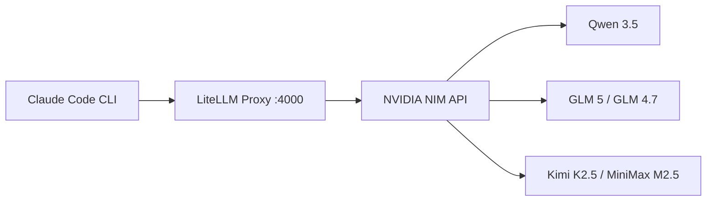

## The Situation

If you're hitting your Claude usage limits mid-session, or you're a CS/engineering student who wants to try Claude Code without a paid subscription, this post is for you.

NVIDIA offers free API access to a wide catalog of open-source LLMs through [build.nvidia.com](https://build.nvidia.com) — their hosted NIM (NVIDIA Inference Microservices) platform. Strong coding models like Qwen 3.5, GLM 5, Kimi K2.5, and MiniMax M2.5 are all available at no cost with no credit card required. The free tier has no expiry — just rate limits (~40 requests/minute).

The idea is simple: when your Anthropic or Copilot usage runs out, you can quickly switch over to NIM-backed models and keep working. For students, it's a way to get hands-on with Claude Code's workflow using free inference — no subscription needed.

By placing a [LiteLLM Proxy](https://github.com/BerriAI/litellm) in front of NVIDIA NIM, you can point Claude Code CLI at these models. LiteLLM handles the translation between Anthropic's Messages API (which Claude Code speaks) and the OpenAI-compatible API (which NIM speaks).



> **Fair warning:** Claude Code will be talking to open-source models, not Claude. Extended thinking, complex tool use chains, and multi-file editing may not work reliably — it depends on the model's capabilities. Basic chat, code generation, and single-file edits generally work fine.

## Prerequisites

- [Docker](https://docs.docker.com/get-docker/) installed and running
- [Claude Code CLI](https://docs.anthropic.com/en/docs/claude-code/overview) installed

## Step 1: Get an NVIDIA NIM API Key

1. Go to [build.nvidia.com](https://build.nvidia.com) and create a free NVIDIA account
2. Complete phone verification via SMS (some regions may have trouble receiving the code — try a different number if needed)
3. Navigate to any model page and click **"Get API Key"** (or go to the API Keys section)
4. Click **"Create API Key"** and copy it — it's only shown once
5. The key format looks like `nvapi-...`

No credit card or paid plan is required.

## Step 2: Set Up LiteLLM Proxy

Create an empty folder and add a `config.yaml`:

```yaml
model_list:
  - model_name: claude-sonnet-4-6
    litellm_params:
      model: nvidia_nim/qwen/qwen3.5-122b-a10b
      api_key: os.environ/NVIDIA_NIM_API_KEY

  - model_name: claude-opus-4-6
    litellm_params:
      model: nvidia_nim/z-ai/glm5
      api_key: os.environ/NVIDIA_NIM_API_KEY

  - model_name: claude-haiku-4-5
    litellm_params:
      model: nvidia_nim/moonshotai/kimi-k2.5
      api_key: os.environ/NVIDIA_NIM_API_KEY

litellm_settings:
  drop_params: true

general_settings:
  master_key: "sk-litellm-local"
```

The model names (`claude-sonnet-4-6`, etc.) are aliases that Claude Code expects — you're mapping them to whichever NIM models you want. In this example, Qwen 3.5 handles the default Sonnet slot, GLM-5 takes the Opus slot for heavier tasks, and Kimi K2.5 fills the Haiku slot for quick responses. Swap any model into any slot based on your preference.

The `nvidia_nim/` prefix tells LiteLLM to route requests to `https://integrate.api.nvidia.com/v1` automatically. The `drop_params: true` setting is important — Claude Code sends Anthropic-specific parameters that NIM models don't understand, and this silently drops them.

Pick whichever models you prefer. The [NIM model catalog](https://build.nvidia.com/models) has 40+ models available. Some strong options for coding tasks:

| Model | NIM ID | Notes |
|-------|--------|-------|
| Qwen 3.5 122B | `qwen/qwen3.5-122b-a10b` | Strong coder, MoE (10B active) |
| GLM-5 | `z-ai/glm5` | 744B MoE, excellent reasoning |
| GLM-4.7 | `z-ai/glm4_7` | 358B, solid coding performance |
| Kimi K2.5 | `moonshotai/kimi-k2.5` | 1T MoE from Moonshot AI |
| MiniMax M2.5 | `minimaxai/minimax-m2.5` | 230B MoE, well-rounded |

## Step 3: Run the Proxy

Start the LiteLLM Docker container from the same folder as your `config.yaml`:

```bash
docker run -d \
  -p 4000:4000 \
  -e NVIDIA_NIM_API_KEY="nvapi-your-key-here" \
  -v $(pwd)/config.yaml:/app/config.yaml \
  --name litellm-nim \
  --restart always \
  docker.litellm.ai/berriai/litellm:main-stable \
  --config /app/config.yaml
```

Verify it's running:

```bash
docker logs litellm-nim
```

You should see:

```
INFO: Uvicorn running on http://0.0.0.0:4000
```

Test that models are accessible:

```bash
curl http://localhost:4000/v1/models \
  -H "Authorization: Bearer sk-litellm-local" | jq '.data[].id'
```

## Step 4: Connect Claude Code

Add an alias to your `~/.zshrc` (or `~/.bashrc`) so you can launch Claude Code via NIM with a single command:

```bash
alias claude-nim='\
  ANTHROPIC_BASE_URL="http://localhost:4000" \
  ANTHROPIC_API_KEY="sk-litellm-local" \
  ANTHROPIC_MODEL="claude-sonnet-4-6" \
  ANTHROPIC_DEFAULT_OPUS_MODEL="claude-opus-4-6" \
  ANTHROPIC_DEFAULT_SONNET_MODEL="claude-sonnet-4-6" \
  ANTHROPIC_DEFAULT_HAIKU_MODEL="claude-haiku-4-5" \
  claude'
```

Reload your shell and launch:

```bash
source ~/.zshrc
claude-nim
```

Claude Code will route all API calls through LiteLLM, which forwards them to NVIDIA NIM. The environment variables are only set for that session — they won't affect other terminal windows or a regular `claude` launch.

> If you prefer to test without an alias first, you can also `export` each variable individually and then run `claude`.

## Tips

**Popular models can be slow or rate-limited.** The largest models tend to get overloaded on the free tier. If you're getting 429 errors or slow responses, try a smaller or less popular model.

**Swap models without restarting Claude Code.** Just edit `config.yaml` and restart the LiteLLM container:

```bash
docker restart litellm-nim
```

**Check available NIM models from the terminal:**

```bash
curl -s https://integrate.api.nvidia.com/v1/models \
  -H "Authorization: Bearer nvapi-your-key-here" | jq '.data[].id'
```

**View proxy logs for debugging:**

```bash
docker logs -f litellm-nim
```

## All Set!

You now have a free, no-subscription fallback for Claude Code. When your Anthropic or Copilot usage runs dry, just type `claude-nim` and keep going with open-source models.

If you also have a GitHub Copilot subscription, check out [Using GitHub Copilot Models via LiteLLM Proxy]() — you can even run both providers behind the same LiteLLM instance by combining the config files.