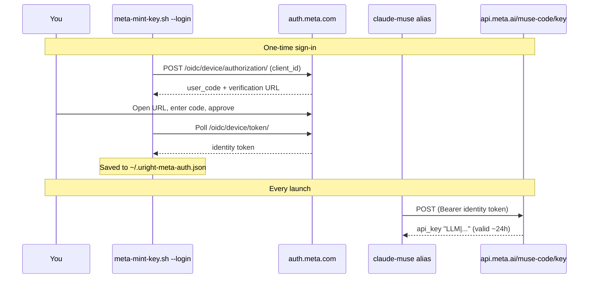

## The Situation

Meta recently released **Muse Spark 1.3**. It's highly capable and very cheap. The lowest tier of the **Muse Code** subscription is only **$6.99 CAD / month**, which makes it a good fallback for when my Anthropic Max subscription hits its limit mid-week.


### Why Not Just Use NVIDIA NIM?

In a [previous post](/posts/running-claude-code-for-free-with-nvidia-nim/) I set up Claude Code on NVIDIA NIM, and that setup is still great. It's free, and `deepseek-4.1-flash` is a solid workhorse model. The catch is speed: NIM's free tier can be slow, and waiting through a long agentic session adds up. What I wanted was a fast, reliable backup for when my Anthropic limit runs out. At $6.99 CAD/month, Muse Spark is cheap enough to keep around for exactly that.

The Meta developer console even has a Claude Code section on its dashboard, so I expected setup to take five minutes. It didn't.

## The Problem: No API Key for Subscription Projects

After subscribing to Muse Code, I went to the [Meta Developer portal](https://dev.meta.ai/api-keys) to create an API key for Claude Code. The portal refused:

```text
Pay-as-you-go API keys cannot be created for the subscription project.
```

So the subscription includes Claude Code access, but you can't create the API key that Claude Code needs to authenticate. API keys are only for pay-as-you-go projects.


## The Clue: Pi Can Already Do It

I then noticed that the [Pi coding agent](https://github.com/earendil-works/pi) can connect to a Muse Code subscription directly with `/login meta`. If Pi can get a working credential out of the subscription, so can we.

I pointed Pi at its own source code and had it reverse-engineer the Meta login flow. It turns out to be a standard OAuth device flow ([RFC 8628](https://datatracker.ietf.org/doc/html/rfc8628)), plus one extra step that **mints a short-lived Model API key** from your Meta identity token. I wrote a small script that does the login without needing Pi, and after that a single `curl` call mints a key:



The details that matter:

- The **identity token** from the device flow can't be used for inference. It's only good for minting keys.
- `POST https://api.meta.ai/muse-code/key` with `Authorization: Bearer <identity token>` returns `{ "api_key": "LLM|..." }`.
- That minted key behaves exactly like a regular `META_API_KEY` and is valid for about **24 hours**.
- The identity token **cannot be refreshed**. Once it expires, you sign in again.

> **Credit where it's due:** everything here comes from the work of the [Pi coding agent](https://github.com/earendil-works/pi) team. Their Meta OAuth implementation (`packages/ai/src/auth/oauth/meta.ts`) is the reference for this script. If you want a full coding agent that supports Muse Code out of the box, use Pi.
{: .prompt-tip }

## Prerequisites

- An active **Muse Code** subscription on Meta
- [Claude Code CLI](https://docs.anthropic.com/en/docs/claude-code/overview) installed
- `curl` and `jq`
- macOS or Linux. I've tested this on macOS.

## Step 1: Sign In with Meta

Run the one-time login. Nothing gets installed: the script is streamed straight into `bash`, and `--login` is passed to it.

```bash
curl -fsSL https://uright.ca/assets/scripts/meta-mint-key.sh | bash -s -- --login
```

> Piping a script from the internet into your shell deserves a look first, especially one that handles a login token. **[View meta-mint-key.sh](/assets/scripts/meta-mint-key.sh)** to see exactly what it does. It only talks to `auth.meta.com` and `api.meta.ai`, and the only file it writes is `~/.uright-meta-auth.json`.
{: .prompt-tip }

```text
Open this link and sign in with the Meta account that has Muse Code:
  https://auth.meta.com/oauth/device/?code=ABCD-1234
Enter code: ABCD-1234
Waiting for approval...
Signed in. Credential saved to /Users/you/.uright-meta-auth.json
```

Open the link, sign in with the Meta account that holds your Muse Code subscription, and approve the code. The script waits for your approval, mints a first key to confirm that everything works, and saves the credential with `0600` permissions.


## Step 2: Create the `claude-muse` Alias

Next, use the same alias pattern from my [NVIDIA NIM post](/posts/running-claude-code-for-free-with-nvidia-nim/). Meta's API accepts Claude Code's Anthropic-style requests, so you don't need a proxy. Point `ANTHROPIC_BASE_URL` at `api.meta.ai` and map every model slot to Muse Spark.

After you've signed in, you don't need the script anymore. The alias mints a fresh key from your saved identity token each time it runs, so the ~24h key lifetime never matters.

Add this to your `~/.zshrc` (or `~/.bashrc`):

```bash
alias claude-muse='\
  ANTHROPIC_BASE_URL="https://api.meta.ai" \
  ANTHROPIC_AUTH_TOKEN="$(curl -fsS -X POST https://api.meta.ai/muse-code/key \
    -H "Authorization: Bearer $(jq -r .meta.refresh ~/.uright-meta-auth.json)" \
    -H "Content-Type: application/json" -H "x-api-version: 1.0.0" -d "{}" | jq -r .api_key)" \
  ANTHROPIC_MODEL="muse-spark-1.3-contributor" \
  ANTHROPIC_DEFAULT_OPUS_MODEL="muse-spark-1.3-contributor" \
  ANTHROPIC_DEFAULT_SONNET_MODEL="muse-spark-1.3-contributor" \
  ANTHROPIC_DEFAULT_HAIKU_MODEL="muse-spark-1.3-contributor" \
  CLAUDE_CODE_SUBAGENT_MODEL="muse-spark-1.3-contributor" \
  ENABLE_TOOL_SEARCH="true" \
  claude'
```

The single quotes delay both `$(...)` calls until the alias runs, so every launch gets a new key.

Here's what each variable does:

| Variable                                        | Purpose                                                                                                              |
| ----------------------------------------------- | -------------------------------------------------------------------------------------------------------------------- |
| `ANTHROPIC_BASE_URL`                            | Sends Claude Code's requests to Meta instead of Anthropic                                                            |
| `ANTHROPIC_AUTH_TOKEN`                          | A freshly minted Muse Code key, sent as a Bearer token                                                               |
| `ANTHROPIC_MODEL` / `ANTHROPIC_DEFAULT_*_MODEL` | Maps the Opus, Sonnet, and Haiku slots to Muse Spark, so nothing asks for a Claude model name that Meta doesn't know |
| `CLAUDE_CODE_SUBAGENT_MODEL`                    | Subagents (Explore, Plan, etc.) use Muse Spark too                                                                   |
| `ENABLE_TOOL_SEARCH`                            | Loads MCP tool schemas only when they're needed instead of sending them all up front                                 |

Reload your shell:

```bash
source ~/.zshrc
```

## Step 3: Launch It

```bash
claude-muse
```

Run `/status` inside Claude Code to confirm that the base URL and model point to Meta.

## Tips

**When Claude Code reports an authentication error on launch.** Your identity token has most likely expired, and it can't be refreshed. Minting then fails, so the alias passes an empty key. Run the Step 1 one-liner again.

**When the login says `Complete setup at https://...`.** Meta accepted the login but wants something finished first, usually billing. Open the URL, finish setup, and run the login again.

**Treat `~/.uright-meta-auth.json` like a password.** The identity token in it is the longest-lived secret in this setup. It's saved as plain JSON with `0600` permissions. Don't commit it, sync it, or share it.

**Keep your Anthropic profile separate.** Plain `claude` still uses your Anthropic Max login, so you can switch to `claude-muse` when you hit your limit and switch back when it resets. For free but slower sessions, [`claude-nim`](/posts/running-claude-code-for-free-with-nvidia-nim/) is still a good third option.

## All Set!

For $6.99 CAD a month, Muse Spark 1.3 makes a fast backup for Claude Code. The only tricky part is the missing API key on subscription projects. A one-line login signs you in once, and a shell alias mints a fresh key every time you launch. Big thanks to the [Pi](https://github.com/earendil-works/pi) team for working out the Meta login flow first.
