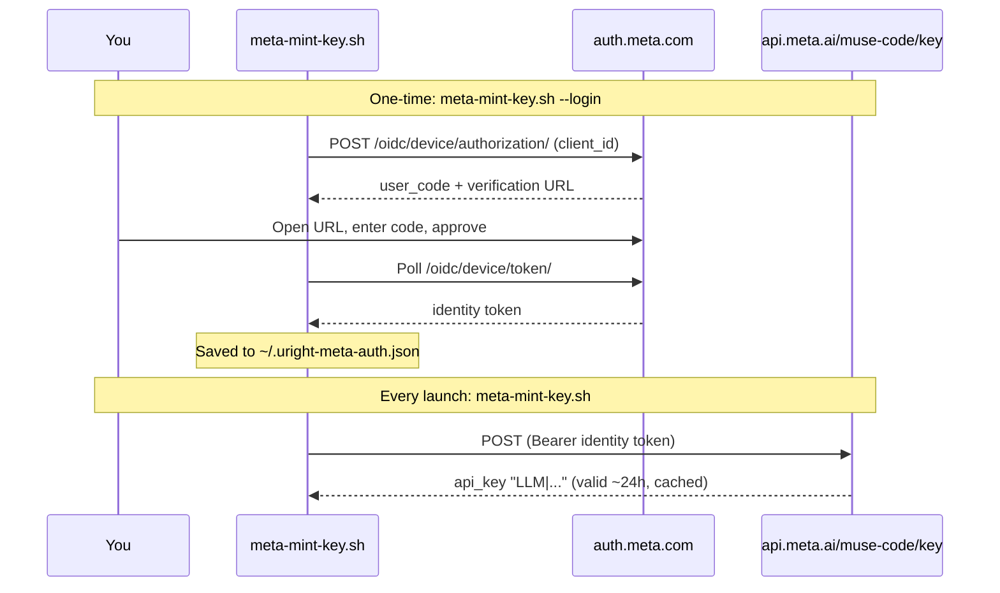

## The Situation

Meta recently released **Muse Spark 1.3**. It's highly capable and very cheap. The lowest tier of the **Muse Code** subscription is only **$6.99 CAD / month**, which makes it a good fallback for when my Anthropic Max subscription hits its limit mid-week.


### Why Not Just Use NVIDIA NIM?

In a [previous post](/posts/running-claude-code-for-free-with-nvidia-nim/) I set up Claude Code on NVIDIA NIM, and that setup is still great. It's free, and `deepseek-4.1-flash` is a solid workhorse model. The catch is speed: NIM's free tier can be slow, and waiting through a long agentic session adds up. What I wanted was a fast, reliable backup for when my Anthropic limit runs out. At $6.99 CAD/month, Muse Spark is cheap enough to keep around for exactly that.

The Meta developer console even has a Claude Code section on its dashboard, so I expected setup to take five minutes. It didn't.

## The Problem: No API Key for Subscription Projects

After subscribing to Muse Code, I went to the [Meta Developer portal](https://dev.meta.ai/api-keys) to create an API key for Claude Code. The portal refused:

```text
Pay-as-you-go API keys cannot be created for the subscription project.
```

So the subscription includes Claude Code access, but you can't create the API key that Claude Code needs to authenticate. API keys are only for pay-as-you-go projects.


## The Clue: Pi Can Already Do It

I then noticed that the [Pi coding agent](https://github.com/earendil-works/pi) can connect to a Muse Code subscription directly with `/login meta`. If Pi can get a working credential out of the subscription, so can we.

I pointed Pi at its own source code and had it reverse-engineer the Meta login flow. It turns out to be a standard OAuth device flow ([RFC 8628](https://datatracker.ietf.org/doc/html/rfc8628)), plus one extra step that **mints a short-lived Model API key** from your Meta identity token. The script in this post does the same thing without needing Pi:



The details that matter:

- The **identity token** from the device flow can't be used for inference. It's only good for minting keys.
- `POST https://api.meta.ai/muse-code/key` with `Authorization: Bearer <identity token>` returns `{ "api_key": "LLM|..." }`.
- That minted key behaves exactly like a regular `META_API_KEY` and is valid for about **24 hours**.
- The identity token **cannot be refreshed**. Once it expires, you sign in again.

> **Credit where it's due:** everything here comes from the work of the [Pi coding agent](https://github.com/earendil-works/pi) team. Their Meta OAuth implementation (`packages/ai/src/auth/oauth/meta.ts`) is the reference for this script. If you want a full coding agent that supports Muse Code out of the box, use Pi.
{: .prompt-tip }

## Prerequisites

- An active **Muse Code** subscription on Meta
- [Claude Code CLI](https://docs.anthropic.com/en/docs/claude-code/overview) installed
- `curl` and `jq` (the script falls back to `node` if `jq` isn't installed)
- macOS or Linux. I've tested the script on macOS.

## Step 1: Save the Key-Minting Script

The script does two jobs:

- `--login` signs in with your Meta account (a one-time step) and saves the identity token to `~/.uright-meta-auth.json` with `0600` permissions.
- Without flags, it prints a valid key. It reuses the cached key if it's valid for at least another 5 minutes. Otherwise it mints a fresh one and caches it. It prints **only the key** to stdout, so you can use it in command substitution.

Save it as `~/bin/meta-mint-key.sh`:

```bash
#!/usr/bin/env bash
# Mint a Meta Model API key from a Muse Code subscription, for use as META_API_KEY.
#
# Login flow adapted from the Pi coding agent (https://github.com/earendil-works/pi),
# packages/ai/src/auth/oauth/meta.ts.
#
# First run `meta-mint-key.sh --login` once: it signs in with your Meta account
# via the OAuth device flow and stores the identity token in
# ${META_AUTH_FILE:-~/.uright-meta-auth.json} (mode 0600). After that, each run
# reuses the cached key while it's still valid, and otherwise mints a fresh
# ~24h key via POST https://api.meta.ai/muse-code/key and caches it.
#
# Prints the key to stdout (nothing else) so it composes:
#
#   export META_API_KEY="$(meta-mint-key.sh)"
#   meta-mint-key.sh --export
#   meta-mint-key.sh --exec -- my-command --flag
#
# Requires: curl plus jq or node for JSON parsing.
set -euo pipefail

CLIENT_ID="1031625952748946" # Muse Code CLI OAuth client
DEVICE_AUTH_URL="https://auth.meta.com/oidc/device/authorization/"
DEVICE_TOKEN_URL="https://auth.meta.com/oidc/device/token/"
MINT_URL="https://api.meta.ai/muse-code/key"
KEY_LIFETIME_SECS=86400  # minted keys last ~24h
SAFETY_MARGIN_SECS=300   # reuse cached key only if valid for 5+ more minutes
CURL_TIMEOUT=30

STORE_FILE="${META_AUTH_FILE:-$HOME/.uright-meta-auth.json}"

LOGIN=0
FORCE_MINT=0
EMIT_EXPORT=0
EXEC=0

usage() {
	cat <<'EOF'
Usage: meta-mint-key.sh [--login] [--force-mint] [--export] [--exec -- <cmd>...]

  (no flags)   print a valid Meta Model API key to stdout
  --login      sign in with your Meta account (one-time; again when the session expires)
  --force-mint skip the cached key, always mint a fresh one
  --export     print export META_API_KEY='<key>' instead of the bare key
  --exec       run <cmd>... with META_API_KEY set (key never touches history)
  -h, --help   show this help
EOF
}

die() { echo "error: $*" >&2; exit 1; }

while [ $# -gt 0 ]; do
	case "$1" in
		--login) LOGIN=1; shift ;;
		--force-mint) FORCE_MINT=1; shift ;;
		--export) EMIT_EXPORT=1; shift ;;
		--exec) EXEC=1; shift; break ;; # rest (after optional --) is the command
		-h | --help) usage; exit 0 ;;
		*) echo "error: unexpected argument: $1" >&2; usage >&2; exit 2 ;;
	esac
done

if [ "$EXEC" = "1" ]; then
	if [ "${1:-}" = "--" ]; then shift; fi
	if [ $# -eq 0 ]; then echo "error: --exec needs a command" >&2; exit 2; fi
fi

command -v curl >/dev/null || die "curl is required"

# JSON helpers: jq preferred, node fallback.
#   jget <file> <dotted.path>  prints the scalar value, or nothing when absent/null
#   jerror_detail <file>       prints the most useful error message field
#   jcredential                prints the credential JSON built from $CRED_* env vars
if command -v jq >/dev/null; then
	jget() { jq -r "$2 // empty" "$1" 2>/dev/null; }
	jerror_detail() { jq -r '.error_description // .detail // .message // .error // empty' "$1" 2>/dev/null; }
	jcredential() {
		jq -n '{meta: {type: "oauth", refresh: env.CRED_REFRESH, access: env.CRED_ACCESS,
			expires: (env.CRED_EXPIRES | tonumber)}}'
	}
elif command -v node >/dev/null; then
	jget() {
		node -e '
			const fs = require("fs");
			let v = JSON.parse(fs.readFileSync(process.argv[1], "utf8"));
			for (const k of process.argv[2].replace(/^\./, "").split(".")) v = v == null ? v : v[k];
			if (v != null && typeof v !== "object") process.stdout.write(String(v));
		' "$1" "$2" 2>/dev/null
	}
	jerror_detail() {
		node -e '
			const fs = require("fs");
			const d = JSON.parse(fs.readFileSync(process.argv[1], "utf8"));
			for (const k of ["error_description", "detail", "message", "error"]) {
				if (typeof d[k] === "string" && d[k]) { process.stdout.write(d[k]); break; }
			}
		' "$1" 2>/dev/null
	}
	jcredential() {
		node -e '
			const e = process.env;
			const meta = { type: "oauth", refresh: e.CRED_REFRESH, access: e.CRED_ACCESS, expires: Number(e.CRED_EXPIRES) };
			process.stdout.write(JSON.stringify({ meta }, null, 2) + "\n");
		'
	}
else
	die "jq or node is required for JSON parsing"
fi

# ": <detail>" from an error response body, or nothing.
detail() {
	local d
	d="$(jerror_detail "$1")"
	if [ -n "$d" ]; then printf ': %s' "$d"; fi
}

# positive_int <value> <default>
positive_int() {
	if [[ "$1" =~ ^[0-9]+$ ]] && [ "$1" -gt 0 ]; then echo "$1"; else echo "$2"; fi
}

TMP="$(mktemp)"
trap 'rm -f "$TMP"' EXIT

# http_post <url> [curl args...]: body goes to $TMP, prints the HTTP status.
http_post() {
	local url="$1"; shift
	curl -sS -o "$TMP" -w '%{http_code}' -X POST "$url" \
		-H "Accept: application/json" --max-time "$CURL_TIMEOUT" "$@"
}

# save_credential <identity> <key> <expires-epoch-ms>: atomic write, mode 0600.
save_credential() {
	local tmp
	tmp="$(mktemp "$STORE_FILE.XXXXXX")" # mktemp creates files as 0600
	CRED_REFRESH="$1" CRED_ACCESS="$2" CRED_EXPIRES="$3" jcredential >"$tmp"
	mv "$tmp" "$STORE_FILE"
}

# RFC 8628 device flow. Sets IDENTITY to the Meta identity token.
login() {
	local status device_code user_code uri interval expires_in deadline
	status="$(http_post "$DEVICE_AUTH_URL" --data-urlencode "client_id=$CLIENT_ID")" ||
		die "device authorization request failed (network/curl error)"
	[ "${status:0:1}" = "2" ] || die "Meta device authorization failed with status $status$(detail "$TMP")"

	device_code="$(jget "$TMP" '.device_code')"
	user_code="$(jget "$TMP" '.user_code')"
	uri="$(jget "$TMP" '.verification_uri_complete')"
	[ -n "$uri" ] || uri="$(jget "$TMP" '.verification_uri')"
	[ -n "$device_code" ] || die "Meta did not return a device code"
	[[ "$uri" =~ ^https?:// ]] || die "Meta returned an invalid verification URL"
	interval="$(positive_int "$(jget "$TMP" '.interval')" 5)"
	expires_in="$(positive_int "$(jget "$TMP" '.expires_in')" 600)"

	echo "Open this link and sign in with the Meta account that has Muse Code:" >&2
	echo "  $uri" >&2
	echo "Enter code: $user_code" >&2
	echo "Waiting for approval..." >&2

	deadline=$(($(date +%s) + expires_in))
	while :; do
		sleep "$interval"
		[ "$(date +%s)" -lt "$deadline" ] || die "Meta login code expired. Run --login again."
		status="$(http_post "$DEVICE_TOKEN_URL" \
			--data-urlencode "grant_type=urn:ietf:params:oauth:grant-type:device_code" \
			--data-urlencode "device_code=$device_code" \
			--data-urlencode "client_id=$CLIENT_ID")" ||
			die "device token request failed (network/curl error)"
		IDENTITY="$(jget "$TMP" '.access_token')"
		if [ "${status:0:1}" = "2" ] && [ -n "$IDENTITY" ]; then return; fi
		case "$(jget "$TMP" '.error')" in
			authorization_pending) ;;
			slow_down) interval="$(positive_int "$(jget "$TMP" '.interval')" $((interval + 5)))" ;;
			access_denied) die "Meta login was denied." ;;
			expired_token) die "Meta login code expired. Run --login again." ;;
			*) die "Meta device token request failed with status $status$(detail "$TMP")" ;;
		esac
	done
}

# mint_key: exchanges $IDENTITY for a fresh Model API key in KEY.
mint_key() {
	local status
	# Auth header goes through stdin so the token doesn't show up in `ps`.
	status="$(printf 'Authorization: Bearer %s\n' "$IDENTITY" | http_post "$MINT_URL" \
		-H @- \
		-H "Content-Type: application/json" \
		-H "x-api-version: 1.0.0" \
		-d '{}')" || die "mint request failed (network/curl error)"
	if [ "$status" = "401" ] || [ "$status" = "403" ]; then
		die "Meta session expired (status $status)$(detail "$TMP"). Run: meta-mint-key.sh --login"
	fi
	[ "${status:0:1}" = "2" ] || die "Meta API key mint failed with status $status$(detail "$TMP")"
	KEY="$(jget "$TMP" '.api_key')"
	if [ -z "$KEY" ]; then
		local action
		action="$(jget "$TMP" '.action_url')"
		die "Meta did not issue an API key${action:+. Complete setup at $action}"
	fi
}

KEY=""
if [ "$LOGIN" = "1" ]; then
	login
	FORCE_MINT=1
else
	[ -f "$STORE_FILE" ] || die "not signed in. Run: meta-mint-key.sh --login"
	IDENTITY="$(jget "$STORE_FILE" '.meta.refresh')"
	[ -n "$IDENTITY" ] || die "no Meta identity token in $STORE_FILE. Run: meta-mint-key.sh --login"
fi

if [ "$FORCE_MINT" = "0" ]; then
	CACHED="$(jget "$STORE_FILE" '.meta.access')"
	EXPIRES_MS="$(jget "$STORE_FILE" '.meta.expires')" # epoch milliseconds
	if [ -n "$CACHED" ] && [[ "$EXPIRES_MS" =~ ^[0-9]+$ ]] &&
		[ $((EXPIRES_MS / 1000)) -gt $(($(date +%s) + SAFETY_MARGIN_SECS)) ]; then
		KEY="$CACHED"
	fi
fi

if [ -z "$KEY" ]; then
	mint_key
	save_credential "$IDENTITY" "$KEY" $((($(date +%s) + KEY_LIFETIME_SECS) * 1000))
fi

if [ "$LOGIN" = "1" ]; then
	echo "Signed in. Credential saved to $STORE_FILE" >&2
	exit 0
fi

rm -f "$TMP"
trap - EXIT
if [ "$EXEC" = "1" ]; then
	META_API_KEY="$KEY" exec "$@"
elif [ "$EMIT_EXPORT" = "1" ]; then
	printf "export META_API_KEY='%s'\n" "${KEY//\'/\'\\\'\'}"
else
	printf '%s\n' "$KEY"
fi
```

Make it executable:

```bash
chmod +x ~/bin/meta-mint-key.sh
```

## Step 2: Sign In with Meta

Run the one-time login:

```bash
~/bin/meta-mint-key.sh --login
```

```text
Open this link and sign in with the Meta account that has Muse Code:
  https://auth.meta.com/oauth/device/?code=ABCD-1234
Enter code: ABCD-1234
Waiting for approval...
Signed in. Credential saved to /Users/you/.uright-meta-auth.json
```

Open the link, sign in with the Meta account that holds your Muse Code subscription, and approve the code. The script waits for your approval, mints the first key, and saves both. Check that it returns a key:

```bash
~/bin/meta-mint-key.sh | cut -c1-4   # should print: LLM|
```


## Step 3: Create the `claude-muse` Alias

Next, use the same alias pattern from my [NVIDIA NIM post](/posts/running-claude-code-for-free-with-nvidia-nim/). Meta's API accepts Claude Code's Anthropic-style requests, so you don't need a proxy. Point `ANTHROPIC_BASE_URL` at `api.meta.ai` and map every model slot to Muse Spark.

Add this to your `~/.zshrc` (or `~/.bashrc`):

```bash
alias claude-muse='\
  ANTHROPIC_BASE_URL="https://api.meta.ai" \
  ANTHROPIC_AUTH_TOKEN="$META_API_KEY" \
  ANTHROPIC_MODEL="muse-spark-1.3-contributor" \
  ANTHROPIC_DEFAULT_OPUS_MODEL="muse-spark-1.3-contributor" \
  ANTHROPIC_DEFAULT_SONNET_MODEL="muse-spark-1.3-contributor" \
  ANTHROPIC_DEFAULT_HAIKU_MODEL="muse-spark-1.3-contributor" \
  CLAUDE_CODE_SUBAGENT_MODEL="muse-spark-1.3-contributor" \
  ENABLE_TOOL_SEARCH="true" \
  claude'
```

Here's what each variable does:

| Variable                                        | Purpose                                                                                                              |
| ----------------------------------------------- | -------------------------------------------------------------------------------------------------------------------- |
| `ANTHROPIC_BASE_URL`                            | Sends Claude Code's requests to Meta instead of Anthropic                                                            |
| `ANTHROPIC_AUTH_TOKEN`                          | The minted Muse Code key, sent as a Bearer token                                                                     |
| `ANTHROPIC_MODEL` / `ANTHROPIC_DEFAULT_*_MODEL` | Maps the Opus, Sonnet, and Haiku slots to Muse Spark, so nothing asks for a Claude model name that Meta doesn't know |
| `CLAUDE_CODE_SUBAGENT_MODEL`                    | Subagents (Explore, Plan, etc.) use Muse Spark too                                                                   |
| `ENABLE_TOOL_SEARCH`                            | Loads MCP tool schemas only when they're needed instead of sending them all up front                                 |

Reload your shell:

```bash
source ~/.zshrc
```

## Step 4: Launch It

Mint a key into your session, then start Claude Code:

```bash
export META_API_KEY="$(~/bin/meta-mint-key.sh)"
claude-muse
```

Run `/status` inside Claude Code to confirm that the base URL and model point to Meta.

## Tips

**Mint a fresh key on every launch.** The key only lasts about 24 hours, so a terminal left open overnight will start getting 401s. Mint the key inside the alias instead of exporting it once. The single quotes delay the `$(...)` until the alias runs. Because the script caches the key, this costs nothing when the cached key is still valid:

```bash
alias claude-muse='\
  ANTHROPIC_BASE_URL="https://api.meta.ai" \
  ANTHROPIC_AUTH_TOKEN="$(~/bin/meta-mint-key.sh)" \
  ANTHROPIC_MODEL="muse-spark-1.3-contributor" \
  ANTHROPIC_DEFAULT_OPUS_MODEL="muse-spark-1.3-contributor" \
  ANTHROPIC_DEFAULT_SONNET_MODEL="muse-spark-1.3-contributor" \
  ANTHROPIC_DEFAULT_HAIKU_MODEL="muse-spark-1.3-contributor" \
  CLAUDE_CODE_SUBAGENT_MODEL="muse-spark-1.3-contributor" \
  ENABLE_TOOL_SEARCH="true" \
  claude'
```

**When you see `Meta session expired (status 401)`.** Your identity token has expired, and it can't be refreshed. Run `~/bin/meta-mint-key.sh --login` again.

**When you see `Complete setup at https://...`.** Meta accepted the login but wants something finished first, usually billing. Open the URL, finish setup, and run the script again.

**Treat `~/.uright-meta-auth.json` like a password.** The identity token in it is the longest-lived secret in this setup. It's saved as plain JSON with `0600` permissions. Don't commit it, sync it, or paste the minted key into shell history. The script passes the token to `curl` through stdin, so it doesn't show up in `ps` either.

**Keep your Anthropic profile separate.** Plain `claude` still uses your Anthropic Max login, so you can switch to `claude-muse` when you hit your limit and switch back when it resets. For free but slower sessions, [`claude-nim`](/posts/running-claude-code-for-free-with-nvidia-nim/) is still a good third option.

## All Set!

For $6.99 CAD a month, Muse Spark 1.3 makes a fast backup for Claude Code. The only tricky part is the missing API key on subscription projects. A small script signs you in once, mints and caches a fresh key whenever you need one, and a shell alias does the rest. Big thanks to the [Pi](https://github.com/earendil-works/pi) team for working out the Meta login flow first.
