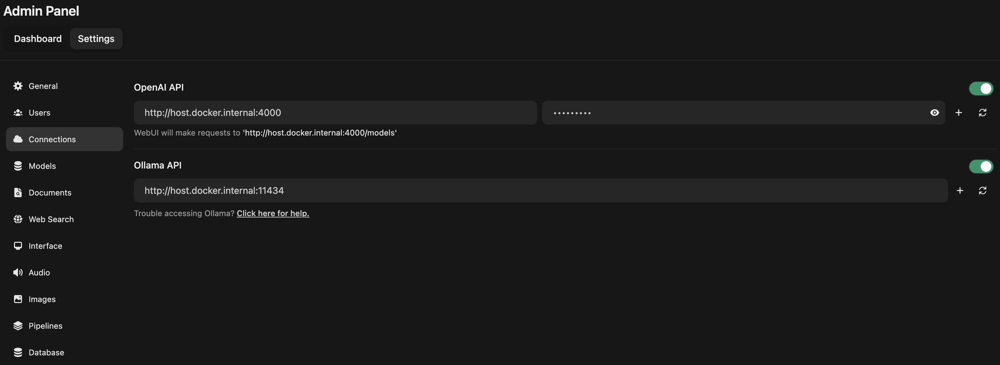
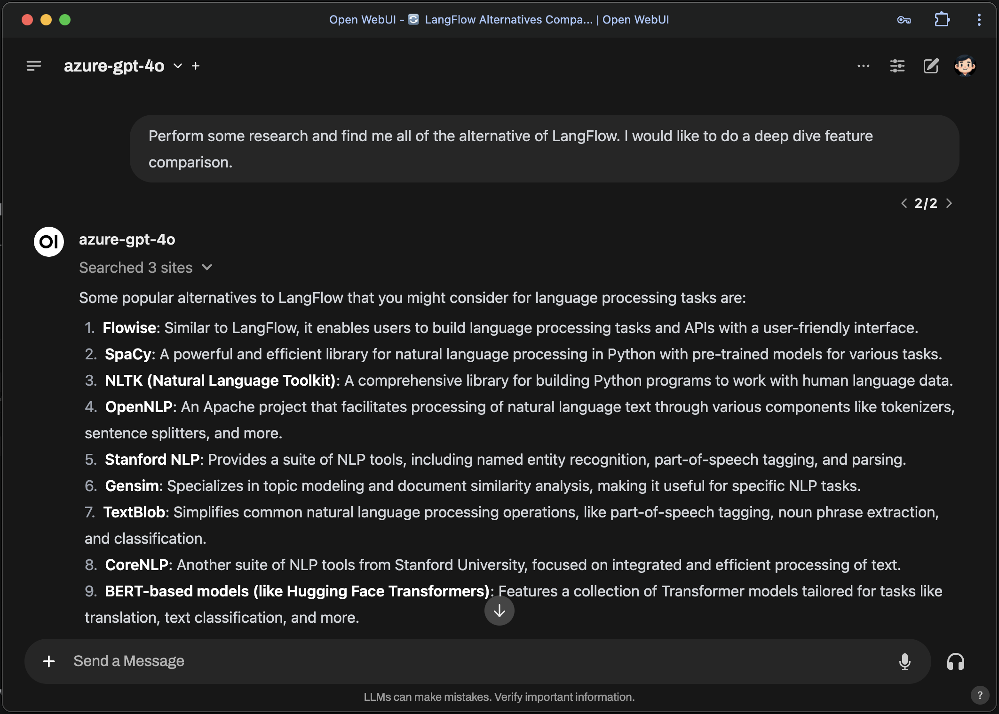

+++
title = 'Unlocking the Power of Azure OpenAI on Open WebUI (Formerly Ollama WebUI)'
description = 'A guide to configure Open WebUI to connect to Azure OpenAI service to unlock gpt-4o models'
date = 2024-07-29T10:45:17-04:00
draft = false
author = 'uright'
tags = ['ollama','azure-openai','litellm', 'open-webui']
image = '/posts/2024-07-29-unlocking-the-power-of-azure-openai-on-open-webui/blog-post-image.jpeg'
toc = true

+++

## Purpose

Open WebUI (previously known as Ollama WebUI) serves as a powerful tool for testing and comparing various open-source models, including those from OpenAI. Its versatility in handling different models makes it a valuable asset for researchers and developers. However, one notable limitation is the absence of built-in support for the Azure OpenAI Service.

In this article, we provide a comprehensive, step-by-step guide on how to connect to the Azure OpenAI Service, enabling you to fully utilize GPT-4 models within Open WebUI. By following this guide, you'll be able to expand the capabilities of Open WebUI and take full advantage of Azure's robust offerings.

## Configuration Overview

We will be using [*litellm proxy server*](https://www.litellm.ai/) to emulate the OpenAI API and connect to the Azure OpenAI service. This will allow us to use GPT-4 models on Open WebUI.

```mermaid
flowchart LR
  browser((Browser))
  openwebui[Open WebUI]
  litellm[LiteLLM Proxy Server]
  azureopenai[« Azure OpenAI »\n GPT-4o]
  
  subgraph "Docker Host"
    openwebui
    litellm
  end

  subgraph "Azure"
    azureopenai
  end

  browser --> openwebui
  openwebui -. "http://host.docker.internal:4000" .-> litellm
  litellm -. "https://{yourendpoint}.openai.azure.com" .-> azureopenai
```

## Configuration Guide

### Prerequisites

Open WebUI should be installed and configured to run in Docker. If not, follow the setup guide here: [Open WebUI Getting Started](https://docs.openwebui.com/getting-started/).

### Configure LiteLLM Proxy Server

1. Create an empty folder with a name of your choice. For this example, we'll call it *my-litellm-proxy*.
2. Navigate into the folder and create a new file named `litellm_config.yaml` with the following content:
   ```yaml
   model_list:
     - model_name: azure-gpt-4o
       litellm_params:
         model: azure/gpt-4o
         api_base: os.environ/AZURE_API_BASE # runs os.getenv("AZURE_API_BASE")
         api_key: os.environ/AZURE_API_KEY # runs os.getenv("AZURE_API_KEY")
         api_version: os.environ/AZURE_API_VERSION # runs os.getenv("AZURE_API_VERSION")
   ```
3. Use the following command to spin up the LiteLLM proxy server using `docker run`:
    ```bash
    docker run -d \
        -v $(pwd)/litellm_config.yaml:/app/config.yaml \
        -e AZURE_API_KEY=$YOUR_AZURE_API_KEY \
        -e AZURE_API_BASE=$YOUR_AZURE_API_BASE \
        -e AZURE_API_VERSION=$YOUR_AZURE_API_VERSION \
        -p 4000:4000 \
        --name litellm-proxy \
        --restart always \
        ghcr.io/berriai/litellm:main-latest \
        --config /app/config.yaml --detailed_debug
    ```
    For enhanced observability of your LLM usage, consider using `docker-compose` to spin up the LiteLLM proxy server with a database and Prometheus for monitoring. Follow this guide on how to do it: [LiteLLM Proxy Deployment](https://docs.litellm.ai/docs/proxy/deploy).
4. Now that your LiteLLM proxy is running, test it with the following `curl` command:
   ```bash
   curl --location 'http://0.0.0.0:4000/chat/completions' \
        --header 'Content-Type: application/json' \
        --data '{
        "model": "azure-gpt-4o",
        "messages": [
            {
            "role": "user",
            "content": "What is the purpose of life?"
            }
        ]
    }'
   ```

### Configure Open WebUI
1. On Open WebUI, click on the top-right profile icon and go to the Admin Panel.
    <br/>
2. Under the **Admin Panel**, select **Settings**, and click on **Connections** from the left navigation menu.
3. Update the OpenAI API Endpoint as follows:
   - **Endpoint**: `http://host.docker.internal:4000`
   - **Secret**: `AnyDummyValue`
   

## All Set!

